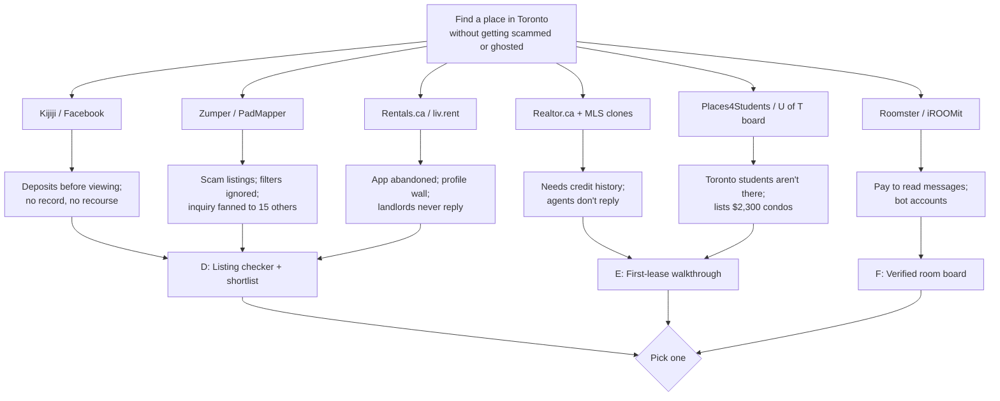

# Research: Toronto apartment hunting for students and first-time renters

2026-09-18

## The problem
- Students, new grads and newcomers in Toronto can't find a place to rent without getting lost, ghosted, or scammed — and no app walks them through it.

Hard limits: iOS app; series stack (FastAPI + Postgres + JWT).

Market facts, for scale only:
- GTA purpose-built vacancy rose to 3.0% in 2025; a new tenant pays $2,073 on average for a one-bedroom vs $1,711 for a sitting tenant — [CMHC via Canadian Mortgage Trends](https://www.canadianmortgagetrends.com/2025/12/rent-growth-slowed-in-2025-as-national-vacancy-rate-continued-to-rise-cmhc/)
- Toronto Police, June 2026: a suspect "advertised apartments for rent on an online platform, allegedly targeting international students searching for housing. Victims provided deposits for the units before viewing them or meeting the suspect in person." — [CTV News](https://www.ctvnews.ca/toronto/article/woman-arrested-in-alleged-rental-fraud-targeting-international-students-in-north-york/)

## Solutions that already exist

### Kijiji (Adevinta)
- What it does: general classifieds; "Long Term Rentals" category with 7,135 Toronto listings on the day checked.
- How it works, step by step:
  1. Open Real Estate → Long Term Rentals → City of Toronto; scroll a list of 40 per page.
  2. Filter by price, unit type (apartment / condo / basement / house), rooms & roommates as a separate sub-category.
  3. Tap a listing; photos, description, sometimes a "Verified" or "Featured" badge.
  4. Tap Reply → message in Kijiji's inbox; many posters write "PROVIDE YOUR TELEPHONE NUMBER TO COORDINATE A TIME TO VIEW APARTMENT" in the ad and take it to phone/WhatsApp from there.
  5. Everything after first contact — viewing, application, deposit, lease — happens off-platform.
- Who it's for, and why: anyone, private landlords especially; it wins on volume, not on trust.
- Money: no public number for Kijiji alone; parent Adevinta calls it "the number one in real estate for rentals in Canada" — [adevinta.com](https://adevinta.com/brand/kijiji-canada/)
- What people complain about (rental-relevant; most reviews are about buy/sell):
  - "Scam ADs like "Please Install Newest Version" are popping up too frequently." — [Play, Jul 2026](https://play.google.com/store/apps/details?id=com.ebay.kijiji.ca&hl=en&gl=CA&reviewId=48a63777-b3c9-469b-8fa4-16ae3c3e1b8e)
  - "Every update is just a new set of bugs and issues." — [Play, Jun 2026](https://play.google.com/store/apps/details?id=com.ebay.kijiji.ca&hl=en&gl=CA)
  - "Honestly every single thing from search to messaging to notifications is worse now." — [App Store](https://apps.apple.com/ca/app/id318979520?see-all=reviews)
- Actually helping people? Yes for finding listings — it's where the inventory is. No for anything after first contact.

### Facebook Marketplace + housing groups
- What it does: free posts by anyone; groups like "OCAD U Housing" and neighbourhood groups double as rental boards — [OCAD U housing page](https://admissions.ocadu.ca/afford/housing-partners)
- How it works, step by step:
  1. Search Marketplace "Property Rentals" or scroll a housing group.
  2. Few filters (price, bedrooms, roughly location).
  3. Tap Message; conversation lives in Messenger.
  4. Poster's Facebook profile is the only identity signal.
  5. Deposit is usually asked for by e-transfer, before or after a viewing, with no platform record.
- Who it's for, and why: students and newcomers already on Facebook; zero cost, zero friction, zero verification.
- Money: no public number.
- What people complain about: no app-store review stream exists for rentals specifically; the evidence is police and press:
  - Brampton case, May 2025–Feb 2026: a woman "advertised apartments for rent using social media" and collected first and last months' rent from 17 tenants who found on move-in day the units weren't available — [Toronto Life via search](https://torontolife.com/city/a-gta-woman-is-accused-of-stealing-60000-in-fake-rental-deposits/)
  - Realtor Will Doyle: "A past client of mine went through the whole process… found a place on Facebook, and then after she lost a deposit, she filed a police report" — [NOW Toronto](https://nowtoronto.com/real-estate/toronto-rental-scams-how-to-avoid-fake-listings/)
- Actually helping people? Kind of — it's where rooms and sublets actually are, and it's where the deposit scams are.

### Zumper (owns PadMapper)
- What it does: US/Canada listing aggregator with alerts, in-app applications, and an AI assistant.
- How it works, step by step:
  1. Search a city; map + list; "extensive filters" (price, beds, pets, amenities).
  2. Set alerts → push + email when new listings match.
  3. Tap "Contact" → form goes to the lister; Zumper may fan your inquiry to similar listings.
  4. "Submit apartment applications—all in one app" (Zumper's own words); users report ~$30/person for the application + credit check.
  5. Tour requests and messages in-app; deposit and lease off-platform in Canada.
- Who it's for, and why: renters in big US metros; Canada is a secondary market — Canadian listings appear to be mostly syndicated.
- Money: no public revenue number; has raised roughly $178–181M (Kleiner Perkins, Goodwater, Blackstone) — [Crunchbase](https://www.crunchbase.com/organization/zumper), [PitchBook](https://pitchbook.com/profiles/company/55336-69)
- What people complain about (Play CA, last 300 reviews; 112 rated ≤2):
  - Scams (14+ reviewers): "Be wary, most of the listings on this site are scams. Many are properties that were recently sold and not listed for rent on any other site" — [Play, Nov 2025](https://play.google.com/store/apps/details?id=com.zumper.rentals&hl=en&gl=CA&reviewId=c935e363-9a6f-4262-95e7-e9502d020b28)
  - "This app makes it really really easy for scammers to scam you & doesn't do anything to stop it or prevent it. The only options to report someone is to block them?" — [Play, Feb 2024](https://play.google.com/store/apps/details?id=com.zumper.rentals&hl=en&gl=CA&reviewId=ba336b98-e28f-4351-97e3-84b4b5e32cfa)
  - "This is a scam in Canada. It doesn't allow actual landlords to list anything, and the company just scrapes and steals listings from other services." — [Play, Aug 2025](https://play.google.com/store/apps/details?id=com.zumper.rentals&hl=en&gl=CA&reviewId=b364016c-c752-4915-8b7a-1d4f6efde8ad)
  - Filters ignored (6+): "what is the point of filters if you're just going to show listings based on vibes? I look up a specific city and get other cities." — [Play, Jun 2026](https://play.google.com/store/apps/details?id=com.zumper.rentals&hl=en&gl=CA&reviewId=167fa24b-c85e-45c6-b9bd-5a89e7fe6bbc)
  - "Entered a city in Ontario Canada got a listing in Quebec wrong province" — [App Store, Aug 2025](https://apps.apple.com/ca/app/id678683201?see-all=reviews)
  - Spam / fan-out (6+): "I sent an inquiry for ONE property and then immediately began receiving email and text after email/text that I had inquired about over 15 other properties that I definitely did not send inquiries on." — [Play, Feb 2025](https://play.google.com/store/apps/details?id=com.zumper.rentals&hl=en&gl=CA&reviewId=dffcb756-c5e3-45b3-b4f6-bab2e7292c90)
  - "40 emails in one day??" — [App Store](https://apps.apple.com/ca/app/id678683201?see-all=reviews)
  - Stale: "No updates when the property is rented, so I have to click each and unfavorite once I verify on the mgmt website that it isn't available." — [Play, Sep 2022](https://play.google.com/store/apps/details?id=com.zumper.rentals&hl=en&gl=CA&reviewId=2aebb9dc-ef48-4275-82fe-d90d206c5a3f)
  - Login/verification broken (8+): "couldn't even sign up. wanted me to verify my email with a code and every time I have the code the page refreshed" — [Play, Oct 2025](https://play.google.com/store/apps/details?id=com.zumper.rentals&hl=en&gl=CA&reviewId=132c74e1-0cfa-434e-8309-15687a094e1c)
- Actually helping people? Kind of — good search UI, but users don't trust the listings and can't turn the firehose off.

### PadMapper (Zumper)
- What it does: same inventory as Zumper on a map-first UI; "No broker fees"; roommate and sublet listings.
- How it works, step by step:
  1. Map of pins; drag to search; filter price/beds/pets.
  2. Save favourites.
  3. "One tap connects you to landlords" — contact form; a phone number is often required by the lister.
  4. Account creation now requires email validation and, for posting, government ID.
- Who it's for, and why: renters who think in neighbourhoods, not lists.
- Money: part of Zumper — see above.
- What people complain about (App Store CA 101 reviews, 79 rated ≤2; Play CA 164 of 300 rated ≤2):
  - Ghosted (5+): "I've messaged over 40 people, over the span of 3 months and have only gotten one response" — [App Store, Jul 2022](https://apps.apple.com/ca/app/id1083663440?see-all=reviews)
  - Same-reply scam pattern: "I emailed about four different apartments all in different places to four different names and they all replied with the same exact reply message about it's owned by him and his wife and they want this up front" — [Play, Jun 2026](https://play.google.com/store/apps/details?id=com.padmapper.search&hl=en&gl=CA&reviewId=ac401af6-13e5-42b6-a562-0c986dd67d53)
  - Spam after one contact (5+): "Once you contact one company you get emails from this app that aren't from that company telling you that here are some other things you can look at." — [App Store, Mar 2026](https://apps.apple.com/ca/app/id1083663440?see-all=reviews)
  - Wrong country: "it doesn't even show up in Ontario Canada it shows only "Ontario,NY USA"" — [Play, Jan 2026](https://play.google.com/store/apps/details?id=com.padmapper.search&hl=en&gl=CA&reviewId=3e186e1e-f579-4049-86f5-ce298e737ce7)
  - Forced ID / broken signup (6+): "These guys make you sign up then force you to input government ID looks like information theft." — [App Store, Oct 2023](https://apps.apple.com/ca/app/id1083663440?see-all=reviews)
  - "Their signup process is busted. I was able to create an account but when I clicked on the validate email I got an error and now my account is rejected." — [App Store, Apr 2026](https://apps.apple.com/ca/app/id1083663440?see-all=reviews)
- Actually helping people? Kind of — "The apps layout is great… But the app is only as good as the people on it" (same Jul 2022 review).

### Rentals.ca (Rentsync)
- What it does: Canada-only marketplace, "more than 10,000 long-term rental properties", claims "Every single property on our marketplace has been personally vetted by rental experts".
- How it works, step by step:
  1. Search city → map/list; filter type, budget, beds, baths, pets; "verified listings only" toggle.
  2. Save favourites (needs an account).
  3. Tap a listing → contact form to the property manager.
  4. Reply comes by email/phone from the manager; application and lease off-platform.
- Who it's for, and why: professionally managed buildings; landlords pay to list, renters free.
- Money: no public number; owner Rentsync acquired Urbanation for an undisclosed price — [Connect CRE](https://www.connectcre.ca/stories/rentalsca-owner-acquires-multi-family-research-firm-urbanation/)
- What people complain about (Play CA 1.6★, 208 of 300 recent reviews rated ≤2; Trustpilot 2.0/5):
  - App abandoned (10+ in Aug 2026 alone): "Buggy. Always buggy. Today I can't use it because the app says "This version is no longer supported" and prompts me to update it on the Play Store. There is no update available." — [Play, Aug 2026](https://play.google.com/store/apps/details?id=com.rentalsca&hl=en&gl=CA&reviewId=b5b72782-d72b-416e-aeee-3a9f1d2efeb8)
  - Filters: "the filters don't even work, the one thing I need to work. if it doesn't fall within what I'm asking for why are u showing me?" — [Play, Dec 2025](https://play.google.com/store/apps/details?id=com.rentalsca&hl=en&gl=CA&reviewId=f53871d8-706d-46fc-b77a-61c5101f9df8)
  - No back button: "When you tap on a property to view, there is no button or navigation to go back to the list of properties." — [App Store, Jul 2025](https://apps.apple.com/ca/app/id1475449043?see-all=reviews)
  - Not vetted: "This site would be great if they actually vetted listing. 9/10 listing on this site are fraudulent, misleading, have inaccurate information" — [Trustpilot, Aug 2026](https://ca.trustpilot.com/reviews/6a7219c317c93fccc742edc3)
  - Ghosted / stale (3+): "I've messaged multiple properties with absolutely no response and they have ads on their that have been there for close to a year" — [Trustpilot, Jul 2025](https://ca.trustpilot.com/review/rentals.ca)
  - "everyone who text or emailed was a scammer. I have never had so many scam emails and called until I used this site" — [Trustpilot, May 2024](https://ca.trustpilot.com/review/rentals.ca)
- Actually helping people? Not really on mobile — users say "better off just using the website".

### liv.rent
- What it does: Vancouver-built "safest rental website"; ID-verified landlords and renters, in-app application, digital lease, rent payment.
- How it works, step by step:
  1. Download → redirected to the website to build a renter profile (ID, income, references) before browsing.
  2. Search verified listings; book viewings in-app.
  3. Apply with the saved profile; chat with the landlord in one thread.
  4. Sign the lease digitally; pay rent by card.
- Who it's for, and why: renters who'll trade privacy for safety; landlords who want screening done for them.
- Money: no public number.
- What people complain about (App Store CA 3.6★ on 74 ratings; Play 3.1★):
  - Profile wall (3+): "it directed me to the website to create my personal profile, requesting lots of personal information before I can see the listings." — [App Store, Aug 2026](https://apps.apple.com/ca/app/id1321741040?see-all=reviews)
  - "Do you have to sign up to see the listing?! Seriously?!" — [App Store, Aug 2025](https://apps.apple.com/ca/app/id1321741040?see-all=reviews)
  - Ghosted: "Have not heard back from numerous Landlords for weeks!" — Tristan from Toronto, [App Store, Jul 2021](https://apps.apple.com/ca/app/id1321741040?see-all=reviews)
  - Leaks: "I started receiving a bunch of scam calls and emails right after I registered." — [App Store, Oct 2021](https://apps.apple.com/ca/app/id1321741040?see-all=reviews)
- Actually helping people? Kind of — the right idea (verification), but Toronto inventory is thin and the wall comes before the value.

### Realtor.ca (CREA) + HouseSigma / Condos.ca / Zolo
- What it does: MLS listings, including condo rentals posted by agents. HouseSigma, Condos.ca and Zolo re-skin the same MLS feed.
- How it works, step by step:
  1. Search → toggle "For Rent"; map with agent listings.
  2. Tap → "Contact agent" form; your details go to a realtor.
  3. Realtor books the showing; you submit an offer-to-lease with credit report, employment letter, references.
  4. Landlord's agent picks; first and last months' rent via certified cheque/e-transfer.
- Who it's for, and why: condo renters who can pass a credit check; agents are paid by the landlord, so the renter pays nothing.
- Money: CREA is a non-profit; no public number. HouseSigma/Condos.ca: no public number.
- What people complain about:
  - "This app is loaded with scam rental listings and realtors who don't reply to emails." — [Play, Apr 2026](https://play.google.com/store/apps/details?id=ca.crea.app.consumer&hl=en&gl=CA&reviewId=e07f41c3-1f5d-4869-a98f-4228edc5df43)
  - "holy all u see when ur tryna rent are basements and lower and ect with no way to turn off basements" — [Play, Jun 2026](https://play.google.com/store/apps/details?id=ca.crea.app.consumer&hl=en&gl=CA&reviewId=27040ca1-6709-4aac-a4c6-b728ab82efbf)
  - Condos.ca: "When you click on a property be aware that your email and contact information immediately is forwarded to an agent who will contact you unsolicited." — [App Store, Mar 2026](https://apps.apple.com/ca/app/id1521561102?see-all=reviews)
  - Condos.ca: "there's no button to provide feedback around listings that appear misleading or inaccurate." — [App Store, Mar 2026](https://apps.apple.com/ca/app/id1521561102?see-all=reviews)
- Actually helping people? Yes for credit-worthy condo renters; not for a student with no Canadian credit history.

### Places4Students + U of T Off-Campus Housing (Off Campus Partners / Apartments.com)
- What it does: university-endorsed listing boards. Places4Students is free for students, landlords pay per listing. U of T's site is a white-label of Off Campus Partners (a CoStar/Apartments.com company).
- How it works, step by step:
  1. Student logs in with a school email or browses open.
  2. Filters; U of T added an "International Student-Friendly Search Filter".
  3. Listings are mostly managed buildings (front page: The Quay $2,273–2,997, Daniels on Parliament $2,440–3,880).
  4. Contact form → landlord; footer says the university "do[es] not inspect the rental sites or make inquiries about the listings".
- Who it's for, and why: students who trust a .utoronto.ca domain; landlords who want a student audience.
- Money: no public revenue. Landlords report paying "about $125" and "$139.99" for a premium spot — [Trustpilot](https://ca.trustpilot.com/review/places4students.com)
- What people complain about (6 Trustpilot reviews, all landlords):
  - "If you're looking for U of T, York or Metropolitan University students, forget it... the site is fine and easy to use but it's also expensive compared to Off Campus Housing and other sites but they just don't have any reach." — [Trustpilot, Jan 2025](https://ca.trustpilot.com/reviews/6776fcb18314943770428920)
  - "the prospective viewers have no way to get my response and miss the communication" — [Trustpilot, Jun 2026](https://ca.trustpilot.com/reviews/6a3a9f602829c0a691cc69a4)
- Actually helping people? Not really in Toronto — landlords say Toronto students aren't there, and the U of T board lists $2,300+ units, not rooms.

### Roommate apps — Roomster, iROOMit, SpareRoom
- What it does: profiles for people with a room and people who need one.
- How it works, step by step:
  1. Build a profile (photos, budget, move date).
  2. Swipe/scroll matches.
  3. Pay to unlock messaging (Roomster; iROOMit) — SpareRoom is free-first.
  4. Chat, meet, move in; nothing in-app after that.
- Who it's for, and why: students and new grads who can only afford a room; the paywall is the business.
- Money: no public number; users report "$12 A WEEK TO VIEW YOUR MESSAGES" (Roomster) — [Play, Aug 2026](https://play.google.com/store/apps/details?id=com.roomster&hl=en&gl=CA&reviewId=a2db91e5-904b-4562-871a-4c1347acf2b2)
- What people complain about (Roomster Play CA 2.8★, 266 of 300 rated ≤2; iROOMit 132 of 251):
  - "so in order to even read messages from potential roommates I have to pay a subscription fee? im literally homeless and cant afford your stupid predatory subscription." — [Play, Aug 2026](https://play.google.com/store/apps/details?id=com.roomster&hl=en&gl=CA&reviewId=34aa5611-909c-4e5e-9e8c-9047d05f840b)
  - "they bait you into paying for premium. but all the hidden comments that paying for premium reveals are bot accounts." — [Play, Aug 2026](https://play.google.com/store/apps/details?id=com.roomster&hl=en&gl=CA&reviewId=9cfe2ef7-f430-4273-bffc-d436f722f917)
  - iROOMit: "I was contacted by a scammer, asking for a $100 application fee paid through zelle or chime, however every time I try to report them to the app the moment the report page opens the app just closes." — [Play, Sep 2026](https://play.google.com/store/apps/details?id=com.iroomit.iroomitapp&hl=en&gl=CA&reviewId=28433340-f802-4080-8c84-ed18a1719313)
  - iROOMit: "u have to pay a bunch upfront and no one replies. probably bot accounts." — [Play, Jul 2026](https://play.google.com/store/apps/details?id=com.iroomit.iroomitapp&hl=en&gl=CA&reviewId=9da41441-259a-4030-89a8-4860f1db2070)
- Actually helping people? No — paywall in front of an empty room.

## The pattern
- They all get right: map + filters + save. The search UI is a solved problem; nobody is losing on search.
- They all get wrong, in the same three ways:
  - **Trust.** Every platform is a feed of strangers' posts. Scam listings are the top complaint on Zumper, Rentals.ca, Realtor.ca and both roommate apps, and the police cases were on "an online platform" and "social media". Reporting is "block them" or a crashing form.
  - **After first contact, you're alone.** Renters message 4, 15, 40 listings and hear nothing; nobody tells them a unit is gone; the platform's answer is to fan their inquiry out to 15 more.
  - **The wall before the value.** liv.rent's profile, PadMapper's government ID, Roomster's $12/week, Zumper's broken email code — all before the renter has seen anything useful.
- Same business model everywhere: landlords/agents pay, renters are the product, so every feature is a lead-gen feature (Condos.ca forwarding your email "immediately", Zumper's fan-out).
- Who nobody is serving: the person doing this for the **first time in Ontario** — no Canadian credit history, doesn't know that "first and last" is legal but a "holding deposit before viewing" is the scam signature, doesn't know the Ontario Standard Lease exists. Every app assumes the renter already knows the process. The university boards that should teach it list $2,300 condos.

## New ideas nobody has built yet
- **Solution D — Listing checker + shortlist.** Share any listing (Kijiji, Facebook, Rentals.ca link or screenshot) into the app; it runs the checks a realtor tells you to run — same photos on other sites at a different price, "deposit before viewing" language, price far below the CMHC zone average, poster asking for phone/WhatsApp immediately — and gives a plain red/amber/green with the reasons. Your saved listings become one shortlist with status (messaged / viewing booked / gone) and a nudge after 3 days of silence. — fixes: "9/10 listing on this site are fraudulent"; "same exact reply message… they want this up front"; "messaged over 40 people… one response"; police "deposits… before viewing".
  - Buildable? Yes on the stack: iOS share extension → FastAPI; the checks are a `worker` job (reverse-image match, price-vs-zone, text rules). No scraping of Facebook needed — the user brings the listing in. Risk: Kijiji/FB link previews may be login-walled; screenshot + OCR is the fallback.
  - Findable? "is this Toronto rental a scam" is a search people already do (NOW Toronto, Over Here Toronto, Fliku all rank for it); university housing offices already publish scam guides and could link an app.
- **Solution E — First-lease walkthrough for Ontario.** A checklist-driven flow from "I found a place" to "I have keys": what documents to prepare with no Canadian credit, what a landlord may and may not ask for, the Standard Lease clause by clause, what to photograph on move-in, and a deposit-payment gate that refuses to let you tick "paid" until you've ticked "viewed in person / met the landlord / saw ID". — fixes: "Who nobody is serving" above; police "deposits… before viewing them or meeting the suspect".
  - Buildable? Trivially — it's mostly content and state. Fits in D as the last third of the flow.
  - Findable? Only via institutions (universities, settlement agencies). On its own it's a pamphlet, not an app.
- **Solution F — Verified-reply room board for Toronto students.** A rooms/sublets board where posters verify with a Canadian phone + government ID, replies are free, and a listing auto-expires unless the poster confirms it's still available every 7 days. — fixes: "$12 A WEEK TO VIEW YOUR MESSAGES"; "ads… there for close to a year"; "no way to get my response".
  - Buildable? Yes, but it's a two-sided marketplace: worthless until posters show up, and Toronto posters are on Facebook for free.
  - Findable? Only with a campus-by-campus launch. Cut unless D proves demand first.

## The simple picture

## Decision
- Strongest option: **D — Listing checker + shortlist**, with E folded in as its final stage.
- Why: it attacks the complaint that appears on every platform and in the police blotter, it needs no inventory (the inventory is on Kijiji and Facebook and will stay there), and the share-sheet entry point means the app is useful on day one with one user — no marketplace chicken-and-egg. Tradeoff: it doesn't own the listing, so it can never charge landlords; whatever it earns has to come from the renter or an institution, which Stage 2 must answer.
- Not chosen: F needs two sides before it works; E alone is content, not a product.
- Still missing from this file: Reddit voices (r/TorontoRenting, r/askTO) — blocked for me; paste threads in and I'll add them.
